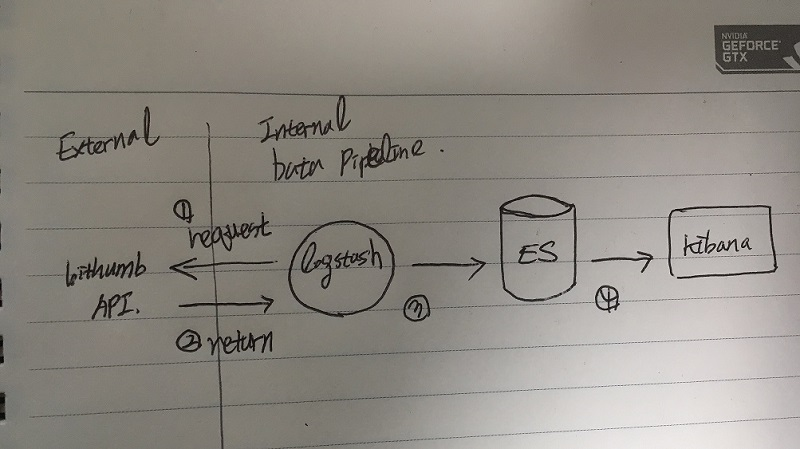
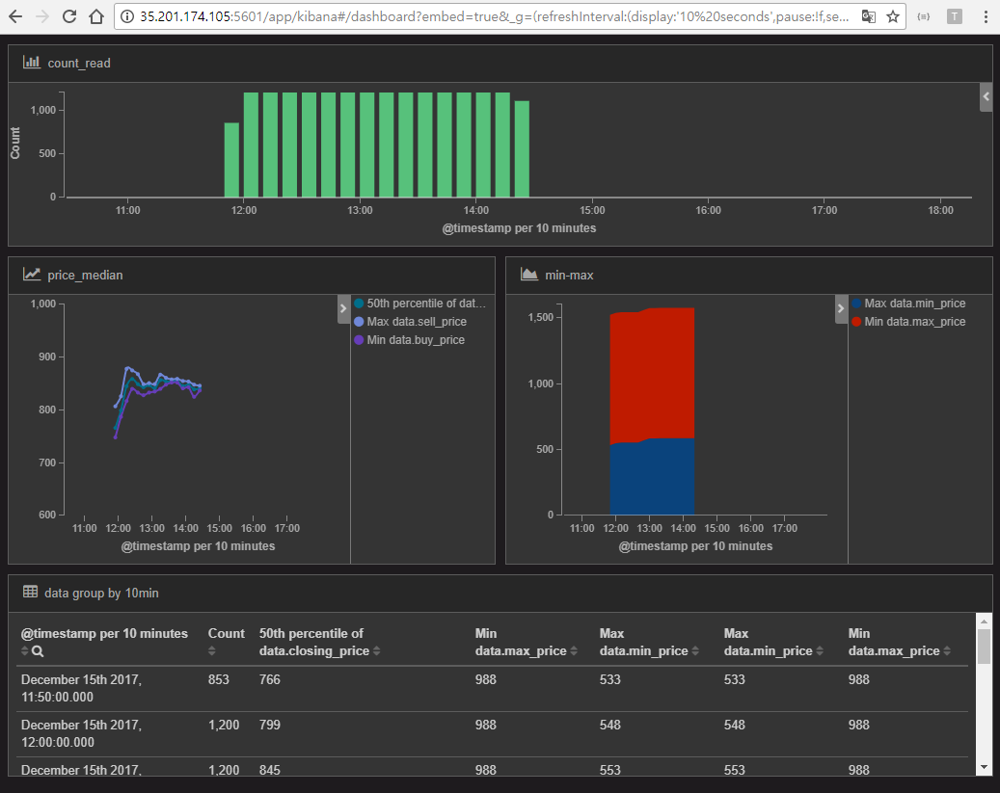

# trading-bot

Course Work Project, 2017 Fall @ Data Science, Seoultech.

### RTS Stack = Real Time Streaming ?
다양한 실시간 데이터 처리 기술 존재 (Ex) Streamsets, Apache Nifi, Flume 등등  
ELK stack 이용해 pipeline 구축 실습하는것 목적으로 함.
#### >> ELK Stack: elasticsearch + logstash + kibana
- elasticsearch: 데이터 저장소, DB와 같은 역활
- logstash: 데이터 수집(pipeline 입구)
- kibana: 웹서버, UI 차트 등 시각화 목적

## Proposal for RTS Stack Practice
- 목적: 데이터 분석을 위한 **데이터 pipeline** 프로젝트 기획
- 분석 데이터: **실시간 암호화폐 시세 정보**
- 주제선정 배경: realtime data handling & ~~realtime decision making~~
- 데이터 출처: [Bithumb API](https://www.bithumb.com/u1/US127), [Sample Code](./SampleCode_bithumb)
  - Public API: bithumb 거래소 공개정보
  - Private API: bithumb 회원 개인정보 (API Key 발급 필요)
- 진행 계획
  - 1차적으로 Public API 이용해 pipeline 구축
  - ~~(기회가 된다면) 실시간 의사결정 알고리즘 구현~~

## Process Document
- Google cloud server [setting manual](./setting_utility.md)
- Run [data-pipeline](./run_data-pipeline.md)
#### Issue:
- bithumb API handling python script 불필요했음.
  * logstash input plungin - http_poller 사용하면 일정간격 갖고, 요청 반복가능.
  * RESTful API processing logstash [configure file](./conf_logstash/restful.conf)
- 다수 코인 다루기 어려워 ripple(XRP) 한개 코인 사용.
- ...

## Data Pipeline Architecture

#### program version:
- elasticsearch: 2.4.0
- logstash: 2.4.0
- kibana: 3.6.2

## Visualization Result
### realtime price of ripple(XRP)
- URL(present): http://35.201.174.105:5601/goto/5e73a64b140f3903ab33e47adf37bf08
- 구글클라우드 유동ip라서 접속 안 될 예정
#### screenshot image (2017-12-15 14:28):

